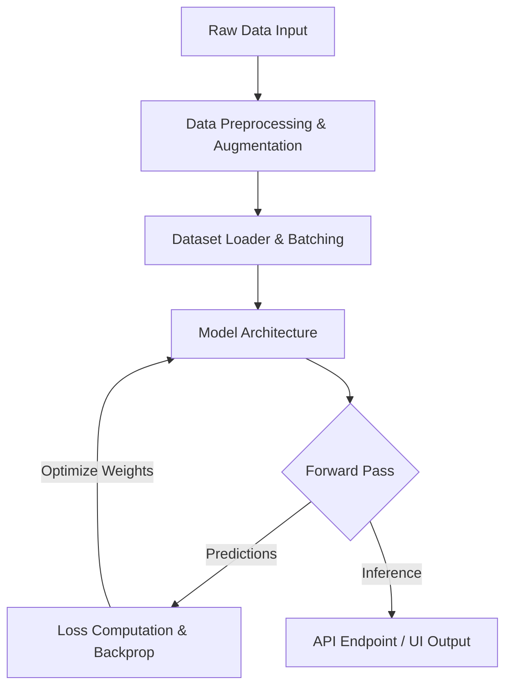

# 🚀 AI/ML Project Title

[](https://opensource.org/licenses/MIT)
[](https://www.python.org/downloads/)
[](https://pytorch.org/)
[](https://huggingface.co/)

A concise, high-impact description of your AI/ML project. Explain the core problem it solves, the primary methodology used (e.g., fine-tuning Llama-3, custom CNN, diffusion models), and the target audience or use cases.

---

## 📌 Table of Contents

- [Key Features](#-key-features)
- [System Architecture](#-system-architecture)
- [Dataset & Data Pipeline](#-dataset--data-pipeline)
- [Model Details](#-model-details)
- [Getting Started](#-getting-started)
  - [Prerequisites](#prerequisites)
  - [Installation](#installation)
- [Usage Guide](#-usage-guide)
  - [1. Data Preparation](#1-data-preparation)
  - [2. Training](#2-training)
  - [3. Evaluation & Inference](#3-evaluation--inference)
- [Results & Performance](#-results--performance)
- [Deployment & API](#-deployment--api)
- [Contributing](#-contributing)
- [License](#-license)

---

## 🌟 Key Features

Highlight what makes this project unique, robust, and functional.
- **State-of-the-Art Architecture**: Powered by [insert model architecture, e.g., ResNet-50, Whisper, custom Transformer].
- **High-Performance Pipeline**: Optimized data loader with pre-fetching and real-time augmentation.
- **Flexible Training**: Support for mixed-precision training (FP16/BF16), multi-GPU (DDP), and gradient accumulation.
- **Production-Ready API**: Includes a lightweight FastAPI deployment script for real-time inference.
- **Interpretable AI**: Built-in Grad-CAM/attention visualization tools to interpret model decisions.

---

## 🗺️ System Architecture

*Describe the flow of data from raw inputs to the final predictions/actions. You can also include a Mermaid diagram to visualize the pipeline:*



---

## 📊 Dataset & Data Pipeline

Provide details about the dataset used to train and evaluate your model.

### 1. Data Source
- **Name**: [e.g., ImageNet, Custom Tabular Customer Data]
- **Size**: [e.g., 50,000 samples, 12GB]
- **Format**: [e.g., TFRecords, CSV, Directory of PNG images]

### 2. Preprocessing & Augmentation
Explain how the raw data is transformed before entering the model:
- Normalization (e.g., Z-score, Min-Max)
- Resizing, Random Cropping, Color Jittering (for vision tasks)
- Tokenization, Padding, Masking (for NLP tasks)

---

## 🧠 Model Details

Document the model's design, hyperparameter choices, and configurations.

### Architecture Specifications
| Parameter | Value / Choice | Description |
| :--- | :--- | :--- |
| **Base Model** | `resnet50` / `bert-base` | Backbone pre-trained weight initialization |
| **Optimizer** | `AdamW` | Weight decay optimizer |
| **Learning Rate** | `5e-5` | Initial learning rate with cosine scheduler |
| **Batch Size** | `32` | Per-device training batch size |
| **Loss Function** | `CrossEntropyLoss` | Objective function minimized |
| **Precision** | `AMP (FP16)` | Mixed-precision training configuration |

---

## 🚀 Getting Started

Follow these steps to set up the project locally on your machine.

### Prerequisites
Ensure you have the following installed:
- **Python**: `3.8` or higher
- **GPU Driver**: CUDA Toolkit `11.8` or `12.1` (if utilizing GPU acceleration)
- **Package Manager**: `pip` or `conda`

### Installation

1. **Clone the repository:**
   ```bash
   git clone https://github.com/your-username/your-ai-project-repo.git
   cd your-ai-project-repo
   ```

2. **Create a virtual environment:**
   ```bash
   # Using venv
   python -m venv venv
   source venv/bin/activate  # On Windows use: venv\Scripts\activate

   # Or using Conda
   conda create -n ai-project python=3.10
   conda activate ai-project
   ```

3. **Install dependencies:**
   ```bash
   pip install --upgrade pip
   pip install -r requirements.txt
   ```

---

## 🛠️ Usage Guide

### 1. Data Preparation
Prepare your raw data folder structure as follows:
```text
data/
├── raw/
│   ├── class_A/
│   └── class_B/
└── processed/
    ├── train.csv
    └── val.csv
```
Run the preprocessing script:
```bash
python src/preprocess.py --input_dir data/raw --output_dir data/processed
```

### 2. Training
Start the model training process. You can configure hyperparameters via command line arguments:
```bash
python src/train.py \
    --data_dir data/processed \
    --epochs 50 \
    --batch_size 32 \
    --lr 5e-5 \
    --checkpoint_dir checkpoints/
```
*Tip: To monitor training progress in real-time, launch TensorBoard or Weights & Biases:*
```bash
tensorboard --logdir runs/
```

### 3. Evaluation & Inference
To evaluate the trained model on your test dataset:
```bash
python src/evaluate.py --model_path checkpoints/best_model.pt --test_dir data/processed/test
```
For single-sample prediction:
```bash
python src/predict.py --model_path checkpoints/best_model.pt --input "path/to/sample.png"
```

---

## 📈 Results & Performance

Present the validation/testing results of your models using clear tables, charts, or confusion matrices.

### Metric Achievements
*Replace this with your actual target performance metrics:*

| Model Version | Accuracy | Precision | Recall | F1-Score | Inference Latency |
| :--- | :---: | :---: | :---: | :---: | :---: |
| Baseline Model | 82.4% | 80.1% | 81.5% | 80.8% | 45ms |
| **Optimized Model (Ours)** | **94.7%** | **93.8%** | **94.2%** | **94.0%** | **12ms** |

### Loss & Accuracy Curves
*(You can embed training plots here)*


---

## 🌐 Deployment & API

This project comes equipped with an easy-to-deploy REST API using **FastAPI** to serve your model in production.

### Run the API locally:
```bash
uvicorn app.main:app --host 0.0.0.0 --port 8000 --reload
```
Once started, you can access:
- **Interactive Documentation (Swagger UI)**: `http://localhost:8000/docs`
- **Inference Endpoint**: `POST http://localhost:8000/predict`

### Example Request Body:
```json
{
  "instances": [
    {
      "features": [5.1, 3.5, 1.4, 0.2]
    }
  ]
}
```

---

## 🤝 Contributing

We welcome contributions to improve this project! To contribute:
1. Fork the Project.
2. Create your Feature Branch (`git checkout -b feature/AmazingFeature`).
3. Commit your Changes (`git commit -m 'Add some AmazingFeature'`).
4. Push to the Branch (`git push origin feature/AmazingFeature`).
5. Open a Pull Request.

---

## 📄 License

Distributed under the MIT License. See [LICENSE](LICENSE) for more information.
